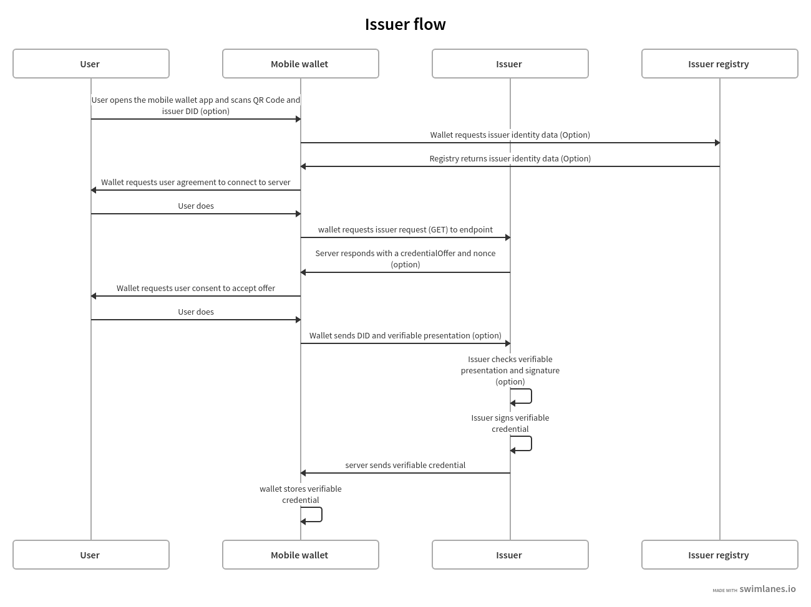
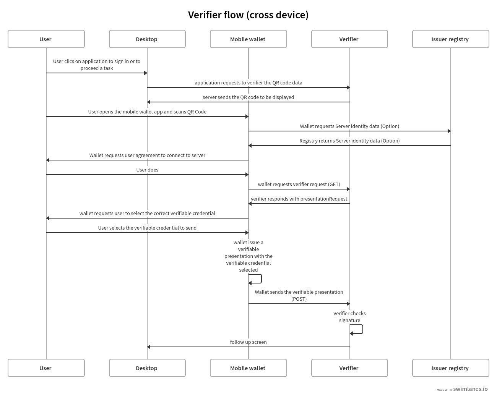

# Interaction between the wallet and Issuers-Verifiers

Updated : 26 July 2022  
Author : Thierry Thevenet, thierry.thevenet@talao.io  

# Documentation
  
* [Overview](#overview)
  - [Collecting a Verifiable Credential](#collecting-a-verifiable-credential)
  - [Requesting a verifiable presentation](#requesting-a-verifiable-presentation)
  - [Issuer and verifier registry](#issuer-and-verifier-registry) 
  - [Issuer and verifier implementation](#Issuer-and-verifier-implementation)
* [Credential offer protocol](#credential-offer-protocol)
  - [Issuer implementation](#issuer-implementation)
  - [Credential manifest](#credential-manifest)  
  - [Wallet rendering](#wallet-redenring)  
* [Presentation request QueryTypes](#presentation-request-query-types) 
  - [Presentation request DIDAuth](#DIDAuth) 
  - [Presentation request QueryByExample](#QueryByExample)
* [Servers return codes](#Servers-return-codes)
* [Universal link](#universal-link)


# Overview

For the interaction of the wallet with Issuers and Verifier, which is a decisive function in the implementation of this type of solution, we have retained the specifications of the W3C Presentation Request as well as the Spruce protocol for the management of the QR Code on a HTTPS transport layer. This protocol has the advantage of being quick and easy to implement while providing most of the necessary functions. There are currently several very promising protocols that are being defined or even in production but these seemed to us too complex and ultimately unnecessary for the current use cases which remain simple.

This protocol is described by Spruce: https://github.com/spruceid/credible#supported-protocols. Talao has enhanced this protocol to adapt it to its own use cases (business logic, governance requirements, etc.). 

This protocol occurs when a user wishes to use his wallet to collect credentials or to present them to access resources. 

In the following document we will noted the options added by Talao as "Talao build".


## Collecting a verifiable credential 

**Wallet <-> Issuer(server)  : A Verifiable Credential (VC) is issued by an issuer and stored by the wallet.**    




## Requesting a verifiable presentation

**Wallet <-> Verifier(server) : A Verifiable Presentation (VP) is presented to the verifier by the wallet. A Verifiable Presentation is a Verifiable Credential signed by the wallet(Holder).**  




## Issuer and verifier registry 

Talao build  

### Motivation
The protocol of interaction between the wallet and an Issuer or a Verifier currently used by Credible is light, simple and quick to implement, However it does not allow the user of the wallet to ensure the identity of the other party but only the domain name specified in the URL encoded in the QR Code. On the other hand, a simple solution based on access to a public register of Issuers / Verifier makes it possible to obtain more information for the user and therefore better control without considerably increasing the complexity of the protocol. However hhis service must be considered as optional due to correlation issues.

### Issuer and verifier implementation
The Issuer (or Verifier) DID is passed as an argument in the QRcode callback URL.

example : https://talao.co/....?issuer=did:ethr:0xee09654eedaa79429f8d216fa51a129db0f72250).


# Credential offer protocol

Talao build  

## Motivation

For holders wishes to engage with Issuers to acquire credentials, there must exist a mechanism for assessing what inputs are required from an issuer to process a request for credential issuance. A manifest is a common data format for describing the inputs a user must provide to an Issuer and the way the VCs should be presented. This draft has been inpired by the Credential Manfifest specification  :

- output descriptors as labels (name, description) et templates objetcs (label name, description, color,...),
- input descriptor to request specific data for issuance,
- share link : a way to use the wallet to link to a cloud service (vault, etc),
- challenge and domain name to sign a VP,
- state (id) to follow the process.

## Issuer implementation
When the wallet makes a GET to the Issuer endpoint, a JSON is returned to the wallet (Issuer GET response):

example:  

```javascript
{
           "type": "CredentialOffer",
           "credentialPreview": {...},
           "expires" : 2022-09-01T19:29:39Z",
            "challenge" : "mjh45RT56",
            "domain" : "talao.co",
            "shareLink" : "https://talao.co/credential/link?issuer=did:tz:tz1e5YakmACgZZprF7YWHMqnSvcWVXZ2TsPW&id=urnn:idnn:4564:...",
            "credential_manifest" : {.. credential manifest....}
                       
}
```

The "shareLink" attribute is an UR to be presented for share link as user convenience.    
The "challenge" and domain arttributes will be used for DID_auth response or verifible presentation.  
The "credential_manifest" attribute is used to define the expected display options of the VC in the wallet (outpout_descriptors).  

Challenge, domain, and sharlink are optional attributes.  

The wallet response will be :

```javascript
{
           "id" : "uuid:urn....",
           “Subject_id”, ”did: tz: tz1e5YakmACgZZprF7YWHMqnSvcWVXZ2TsPW”,
            “presentation”: '{....verifiable presentation...}'
}
```

verifiable presentation is a credential bound with nonce if available in the request. This credential includes all the existing profile attributes if wallet holder consents.  

#### Wallet rendering

Wallet rendering is defined by this standard https://identity.foundation/wallet-rendering/

In the wallet card details screen the Title of the card and Subtitle of the card are attributes "title" an "subtitle" from the output_descriptors.display. The accordion "Description" is the description attribute of the same output_descriptors.diplay.  

The "Informations" accordion is made up of all properties of the output_descriptors.properties.  

Altme supports type "string" without format (it means "text") or with format "email", "uri" and type "number", "integer" and "boo". See an example here :


```javascript
  "output_descriptors":[                       
                        {
                          "id": "00000000",
                          "schema": "Test",
                          "display": {
                            "title": {
                                "path": [],
                                "schema": {
                                  "type": "string"
                                },
                                "fallback": "VC for Test"
                              },
                              "subtitle": {
                                "path": [],
                                "schema": {
                                  "type": "string"
                                },
                                "fallback": "Type and format"
                              },
                            "description": {
                              "path": [],
                              "schema": {
                                "type": "string"
                              },
                              "fallback": "This VC is made up for testing prupose."
                            },
                            "properties": [
                              {
                                "path": ["$.credentialSubject.integer"],
                                "schema": {
                                  "type": "integer"
                                },
                                "fallback": "Unknown",
                                "label": "integer"
                              },
                              {
                                "path": ["$.credentialSubject.number"],
                                "schema": {
                                  "type": "number"
                                },
                                "fallback": "Unknown",
                                "label": "number"
                              },
                              {
                                "path": ["$.credentialSubject.bool"],
                                "schema": {
                                  "type": "bool"
                                },
                                "fallback": "Unknown",
                                "label": "bool"
                              },
                              {
                                "path": ["$.credentialSubject.uri"],
                                "schema": {
                                  "type": "text",
                                  "format" : "uri"
                                },
                                "fallback": "Unknown",
                                "label": "uri"
                              },
                              {
                                "path": ["$.credentialSubject.email"],
                                "schema": {
                                  "type": "text",
                                  "format" : "email"
                                },
                                "fallback": "Unknown",
                                "label": "email"
                              }

                            ]
```


  

An example here with output descriptors :  


```javascript

{
              "id":"PC_01",
              "issuer":{
                "id":"did:tz:tz1NyjrTUNxDpPaqNZ84ipGELAcTWYg6s5Du",
                "name":"Talao issuer",
                "styles": {
                  "thumbnail": {
                    "uri": "https://talao.mypinata.cloud/ipfs/QmU8z1aDDpbgVjXwU8nMvgU3YD4VeUzHTkitsELZRFBBZa",
                    "alt": "Talao logo"
                  },
                  "background": {
                  "color": "#ffffff"
                  },
                  "text": {
                  "color": "#d4d400"
                  }
                }
              },
              "output_descriptors":[
                        {
                          "id": "PCDS_01",
                          "schema": "PCDSAuditorCertificate",
                          "display": {
                            "title": {
                              "path": ["$.name"],
                              "schema": {
                                "type": "string"
                              },
                              "fallback": "Title fallback"
                            },
                            "subtitle": {
                              "path": ["$.description"],
                              "schema": {
                                "type": "string"
                              },
                              "fallback": "Subtitle fallback"
                            },
                            "description": {
                              "text": "This is an electronic version of a PCDS auditor certificate for testing purposes."
                            },
                            "properties": [
                              {
                                "path": ["$.credentialSubject.category"],
                                "schema": {
                                  "type": "string"
                                },
                                "fallback": "Unknown category",
                                "label": "Certificate category"
                              },
                              {
                                "path": ["$.credentialSubject.familyName"],
                                "schema": {
                                  "type": "string"
                                },
                                "fallback": "Unknown auditor name",
                                "label": "Auditor name"
                              },
                              {
                                "path": ["$.credentialSubject.certificationDate"],
                                "schema": {
                                  "type": "string"
                                },
                                "fallback": "Unknown certification date",
                                "label": "Certification Date"
                              },
                              {
                                "path": ["$.credentialSubject.validity"],
                                "schema": {
                                  "type": "string"
                                },
                                "fallback": "Unknown validity",
                                "label": "Certificate validity"
                              }
                            ]
                          }
                        }
              ],
              "presentation_definition":{}
            }
```

#### Input descriptors

An example here with only input descriptors (EmailPass required to issue a credential) :  


```javascript

{
  "credential_manifest": {
    "presentation_definition": {
      "id": "32f54163-7166-48f1-93d8-ff217bdb0653",
      "input_descriptors": [
        {
          "id": "emailPass_input_1",
          "constraints": {
            "fields": [
              {
                "path": [
                  "$.type"
                ],
                "filter": {
                  "type": "string",
                  "pattern": "EmailPass"
                }
              }
            ]
          }
        }
      ]
    }
  }
}

```


# Presentation request query types 

Talao build

## Motivation

When interacting with a Verifier it is likely that it wants to get a presentation made up of specific VCs. It is therefore necessary to be able to specify to the wallet the conditions to be applied to the choice of VCs. The following specifications are taken from a minimalist interpretation of the [W3C draft](https://w3c-ccg.github.io/vp-request-spec/#query-by-example) 

## Verifier implementation

There are 2 possibilities to foresee for the value of query.type of the JSON of the GET response of the Verify (“DIDAuth” or “QueryByExample”):

```javascript
{
           "type": "VerifiablePresentationRequest",
           "query": [{
               "type": “DIDAuth”
               }],
           "challenge": "a random uri",
           "domain" : "talao.co"
}
```

or: 


```javascript
{
           "type": "VerifiablePresentationRequest",
           "query": [{
               "type": "QueryByExample",
               "credentialQuery": [
                   {
                    ……
                   }]
               }],
           "challenge": "a random uri",
           "domain" : "talao.co"
 }
```

## DIDAuth

If Query.type = “DIDAuth” , then it is a basic authentication request that does not include a verifiable credential : there is no selection of credential to propose to the user, call the function didkit.DIDAuth(did, “{“ challenge ”:“ .... ”,“ domain ”:“ ..... ”}”, key) which will create an empty presentation used only for authentication. The presentation passed with the POST request will look like this:

```javascript
{
  "@context": [
    "https://www.w3.org/2018/credentials/v1"
  ],
  "type": "VerifiablePresentation",
  "proof": {
    "type": "EcdsaSecp256k1Signature2019",
    "created": "2021-08-28T16: 13: 23.740Z",
    “challenge”: “d602e96d-08cb-11ec-a6fa-8d5c53eaebfb",
    “domain”: “talao.co”
    "jws ":" eyJhbGciOiJFUzI1NksiLCJjcml0IjpbImI2NCJdLCJiNjQiOmZhbHNlfQ..PgpEElB1tvcY9tdzK6EDKLvysj3vcH-zg5EIiGpk_q4m0NrAmjA81B7QdVvKllSzzfKw-1oTJuu4b4ihCvMXRwA
  "},
  "holder": "did:ethr:0xee09654eedaa79429f8d216fa51a129db0f72250"
}
```

If Query.type ="QueryByExample "then it will take the user selects credentials in a list constituted according to the criteria specified in "credentialQuery.example". Then it will be necessary to call the didkit.issuePresentation (...) function as what is currently done (there is no change in the function call).  

Refer to https://w3c-ccg.github.io/vp-request-spec/#query-by-example for more information.  
    
## QueryByExample
    
### Overview

This is a limited implementation of the Verifiable Presentation Request W3C draft.  

If "credentialQuery": is an empty list, one keeps the current behavior of Credible. The user is asked to select credentials to send. Never mind the VCs.

If "credentialQuery.example" contains {"reason": [......]}
then the Verifier wishes to display an information message to the user. This message will be displayed on the wallet at the time of selection.

If "credentialQuery.example" contains {"type": "some_type"}
then the Verifier wishes to receive VCs conforming to the specified type and the wallet presents a list of VCs consisting only of the specified type.

If "credentialQueryexample" contains { "trustedIssuer" : [ {"issuer" : "did:tz2:12343243223"}]}
then the Verifier wishes to receive VCs sent by the specified Issuer and the wallet presents a list consisting only of the specified issuer.

Nota Bene : 
- There is one credentialQuery.example for each type of VC requested
- By default the credential is required ("required" : "True"), it does not support the other option.
- The reason attribute should be analysed as an array of different languages ("fr", "en", ...) 

#### QBE Examples

##### Example 1
Verifier requests VCs issued by did:tz:tz2NQkPq3FFA3zGAyG8kLcWatGbeXpHMu7yk:

```javascript
{
    "type": "VerifiablePresentationRequest",
    "query": [
        {
            "type": "QueryByExample",
            "credentialQuery": [
                {
                    "example" : {
                        "trustedIssuer": [
                            {
                                "issuer" : "did:tz:tz2NQkPq3FFA3zGAyG8kLcWatGbeXpHMu7yk"
                            }
                        ]
                    }
                }
            ]
        }
    ],
    "challenge": "9d0927c1-08cb-11ec-a6fa-8d5c53eaebfb",
    "domain": "talao.co"
}
```


##### Example 2
Verifier requests a ResidentCard:

```javascript
{
    "type": "VerifiablePresentationRequest",
    "query": [
        {
            "type": "QueryByExample",
            "credentialQuery": [
                {
                    "example" : {
                        "type" : "ResidentCard"
                    }
                }
            ]
        }
    ],
    "challenge": "9d0927c1-08cb-11ec-a6fa-8d5c53eaebfb",
    "domain": "talao.co"
}
```

##### Example 3
Verifier requests a ResidentCard signed by a specific issuer :

```javascript
{
    "type": "VerifiablePresentationRequest",
    "query": [
        {
            "type": "QueryByExample",
            "credentialQuery": [
                {
                    "example" : {
                        "type" : "ResidentCard",
                         "trustedIssuer": [
                            {
                                "issuer" : "did:tz:tz2NQkPq3FFA3zGAyG8kLcWatGbeXpHMu7yk"
                            }
                        ]
                    }
                }
            ]
        }
    ],
    "challenge": "9d0927c1-08cb-11ec-a6fa-8d5c53eaebfb",
    "domain": "talao.co"
}
```

##### Example 4
Verifier attaches messages for user but no credential criters :

```javascript
{
    "type": "VerifiablePresentationRequest",
    "query": [
        {
            "type": "QueryByExample",
            "credentialQuery": [
                {
                    "reason": [
                        {
                            "@language": "en",
                            "@value": "Join a resident card and your driver license"
                        },
                        {
                            "@language": "fr",
                            "@value": "Joindre une carte de résidence et votre permis de conduire"
                        }
                    ]
                }
            ]
        }
    ],
    "challenge": "9d0927c1-08cb-11ec-a6fa-8d5c53eaebfb",
    "domain": "talao.co"
}

```

See https://talao.co/wallet/test/presentationRequest for simulation and testing.

# Universal link

The AltMe wallet makes it possible to manage the interaction with an issuer or a verifier web application through a QR Code or a deeplink.

Depending on the origin of the request, we determine which device is accessing the web application.

## Access from a desktop viewer

Display a QR Code in the form of https://my_endpoint?issuer=my_did

## Access from smartphone viewer

Display a button link in the form of  https://app.altme.io/app/download?uri=https://my_endpoint?issuer=my_did

If the AltMe wallet is not available in the smartphone, the user is referred to the page https://app.altme.io/app/download which offers him access to the Apple Store or the Google store. 


# Servers return codes
   
 ### 200 OK
 Color : Green  
 Message : No message or Credential presented successfully
 
 ### 201 Created
 Color : Green  
 Message : Ressource created
 
 ### 400 Bad Request
 Color : Red  
 Message : Bad request
 
 ### 401  unauthenticated
 Color : Red  
 Message :  The user must authenticate itself to get the requested response. 
 
 ### 403 Forbidden
 Color : Red  
 Message : Unauthorized request.  
 
 ### 408 Request Timeout
 Color : Red  
 Message : Request timeout
 
 ### 429 : Too many requests
 Color : Red  
 Message : The user has sent too many requests in a given amount of time.
 
 ### 500 Internal Server Error
 Color : Red  
 Message : This is a server internal error. Contact the server administrator.
 
 ### 501 Not Implemented
 Color : Red  
 Message : Not implemented 
 
 ### 504 Gateway Timeout
 Color : Red  
 Message : The gateway encountered a timeout

 ### other code
 Color : Red  
 Message : Received invalid status code
